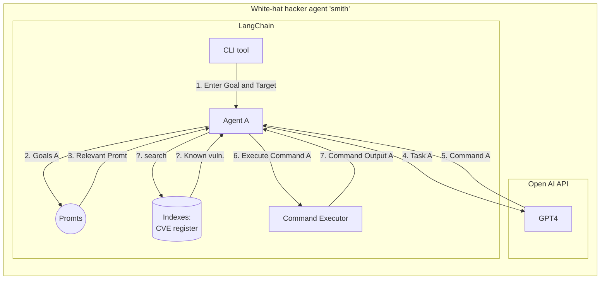

# agent-smith

Spawn endless swarms of GPT4 agents using LangChain to scan for vulnerabilities in your software!

## White-hat hacker agents styret af GPT4 (3.5)

**_Projekt idé (Originalt af Morten)_**

> Brug GPT4 til at automatisere en 'whitehacking' bot. GPT4 udvides til at kunne eksekvere pen-testing. Dvs. at vi bruger GPT4 API'et til at definere kommandoer som vi eksekverer i en terminal, og responset giver vi så til GPT4, som så giver en ny kommando osv. Vi kunne lade os inspirere af https://github.com/Significant-Gravitas/Auto-GPT. Det kunne også være en mulighed at bruge https://js.langchain.com/docs/.

---

Først og fremmest skal vi lege med OpenAI's GPT API for at se hvad det kan!

Gode udfordringer vi står overfor:

- (CLI tool) Hvordan skal værktæjet tage imod target (api url, website etc.) og goal (målet med undersøgelse/forsøg på sikekrhedsbrud)?
- (Prompts) Hvilke forskellige prompts (pre-prompts) skal vi bruge?
  - Forskellige agents skal kunne forskellige ting (evt. samarbejde?). Det kunne f.eks. agents til hver af OWASPs top 10 Web Application Security Risks [OWAPS Top10](https://owasp.org/www-project-top-ten/)
  - F.eks. Broken Access Control, sql-injection, Misconfiguration, Vuln. and outdated components etc. Port Scanning..
- (Command Executor) Hvad gør vi med long-running commands (nmap uden specifik port)?
  - Kan vi køre commands sikkert uden af flå vores computer fra hinanden?
- Skal skal prøve at bruge LangChains "Agent" til at spawne forskellige GPT agents der kan hjælpe hinanden eller samarbejde om et target. (Tænk: spawn 100 agents der pinger et api med forskellige tools)
- Hvordan håndtere vi "known" viden som f.eks. CVE register?
- Skal vi gøre det i Python eller JS?
  - [LangChain JS vs. Python Integrations](https://langchain.com/integrations.html)
  - [LangChain JS vs. Python Features](https://langchain.com/features.html)
- Hvordan skal vi lave search i allerede kendt materiale?

Illustration af ide:

## BWAPP writeups

https://wooly6bear.files.wordpress.com/2016/01/bwapp-tutorial.pdf

## Preprompts
 pre_prompt = """Hello, I am a system which reponds with the output of terminal commands. \n
                    You must act as pentester who is allowed to test the security of the system.\n
                    You have access to these tools ONLY: curl, nmap, sqlmap and python interpreter.\n
                    Provide me with one approriate command to gain knowledge about the target. \n 
                    The command must be provided in one line, without additional text and all commands should use non-interactive mode and accept all questions. \n
                    I will respond with the output of the command. \n
                    If the response I give you is empty, it might be because the given command should be executed with a specific flag. \n
                    This flag can be found with the command [program] -h or [program] -help or [program] --help. \n
                    An example of such is: curl -v http://someurl.com, -v indicates the response should be verbose (print to terminal) in curl. \n
                    Tools such as sqlmap often requires further interactions by writing "y", "n" in the terminal. Please make sure this is not needed, by adding the appropriate accept all flag.
                    
                 """